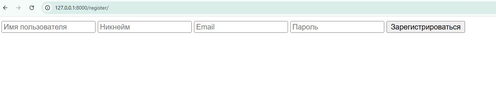
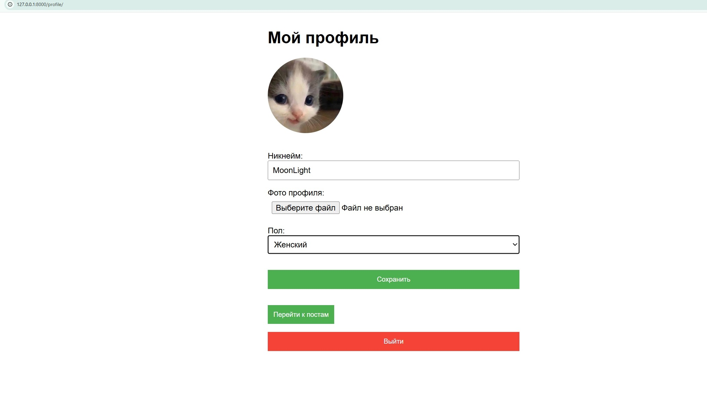
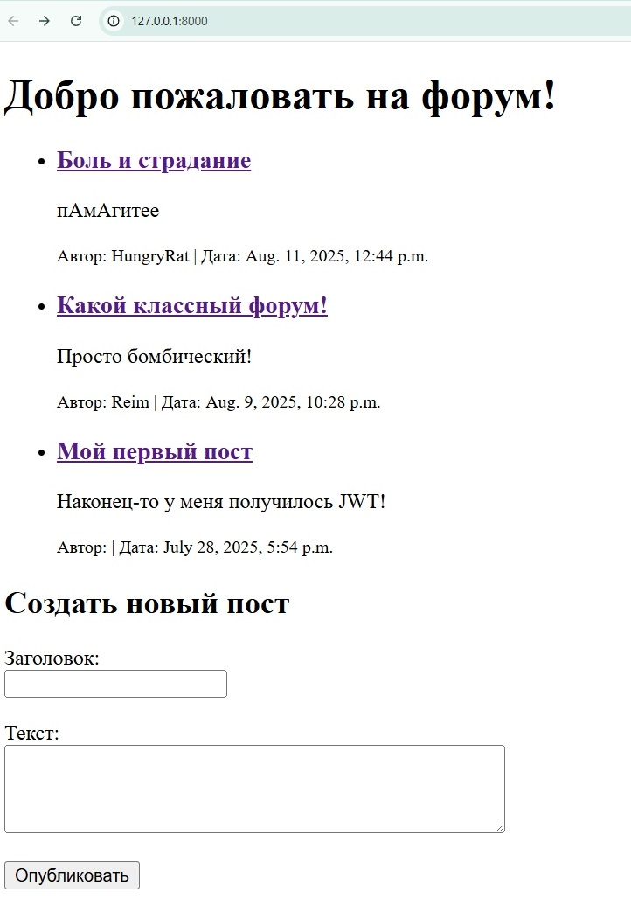
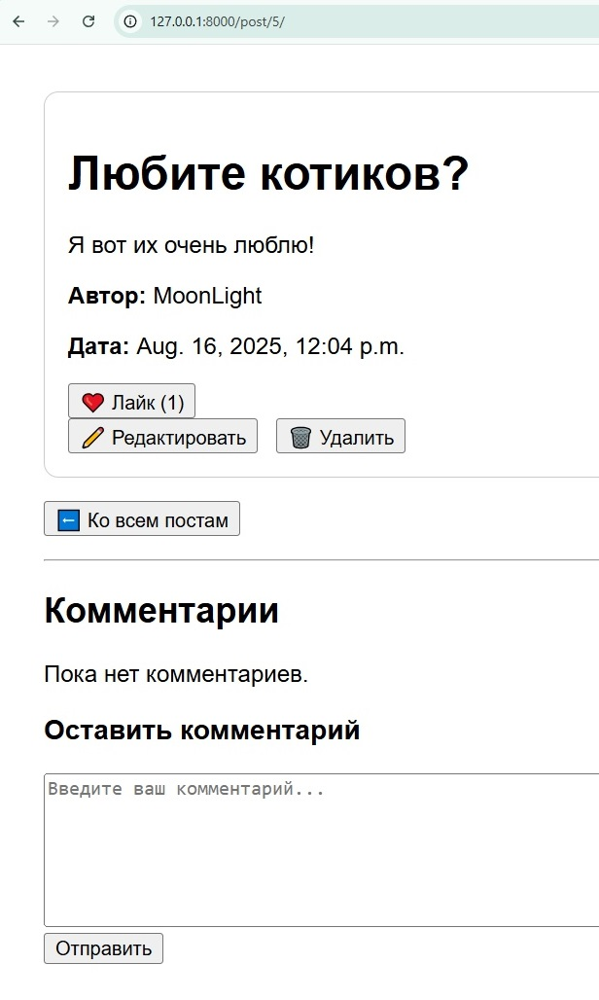
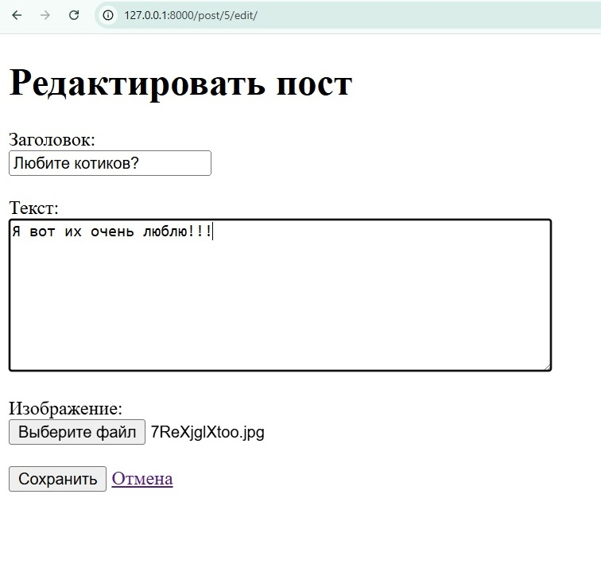

Это написанный мною форум на Django, полностью в классическом виде - сервисом онлайн могут пользоваться сразу несколько пользователей. 

Поскольку моя специальность бэкэнд, фронт минимальный. :)

Чтобы начать пользоваться сервером, сначала нужно зарегистрироваться (http://127.0.0.1:8000/register/). Здесь нужно ввести Имя пользователя, Никнейм (отображается на форуме), email и пароль (при вводе его не видно). На одну и ту же почту или с одним и тем же ником регистрироваться нельзя. 

После будет страница входа (http://127.0.0.1:8000/login/), использующая JWT для аутентификации. Нужно ввести свою почту и пароль, а чтобы не выходить из системы можно нажать "запомните меня" (с помощью cookie). Если еще не регистрировались - не беда, есть кнопка перехода на страницу регистрации.

Вас перенаправят в личный кабинет, где можно поставить себе пол и аватарку, а дальше перейти к самим постам с помощью кнопки перехода "к постам". 

На главной странице (http://127.0.0.1:8000/) виден список всех постов, а так же имя автора и дату с временем написания поста. Внизу можно писать свой пост (Заголовок + сам текст). 
Можно перейти на любой из конкретных постов, просто нажав на нужный заголовок - его можно лайкать (1 лайк на человека к посту) и комментировать. 

Если вы - автор комментария или поста, то можете редактировать их или удалить. Если у вас есть права админа, то можно удалять чужие посты и комментарии. 

Если пользователь НЕ авторизован, то не сможет лайкать, писать посты или комментировать. 

Все данные, по классике, находятся в базе данных, сам проект в основе держит 4 модели (Профиля, Лайка, Поста и Комментария), благодаря которым были созданы вьюшки (views), чтобы Django имел представление об объектах и знал, что с ними делать.

Руты были разделены в двух разных файлах: urls.py - руты для DRF, не требующих браузера для работы с сайтом (но прекрасно работающие в Postman) и web_urls.py - html-руты для того, чтобы форумом можно было пользоваться в браузере.

Так же подключены сериалайзеры (serializers.py), чтобы можно было работать со сложными объектами в JSON-формате (и наоборот).

